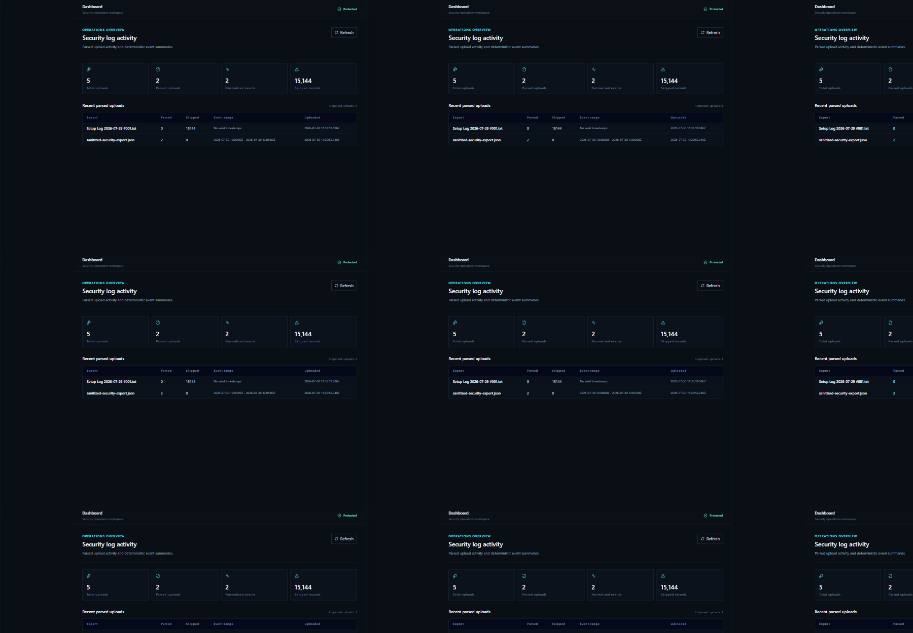
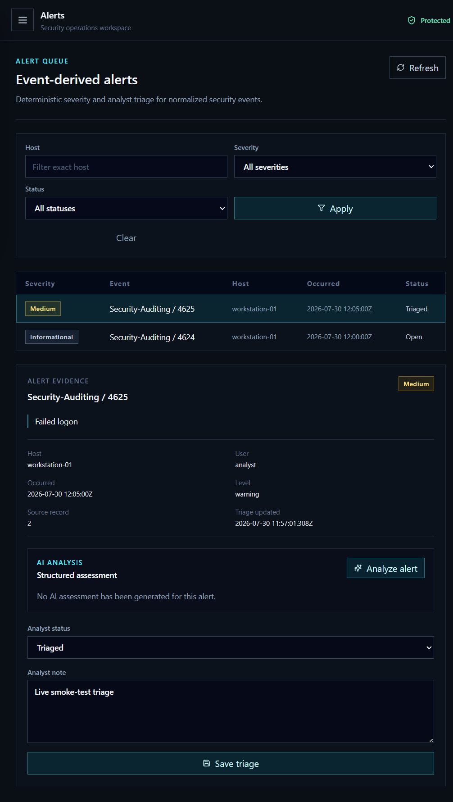
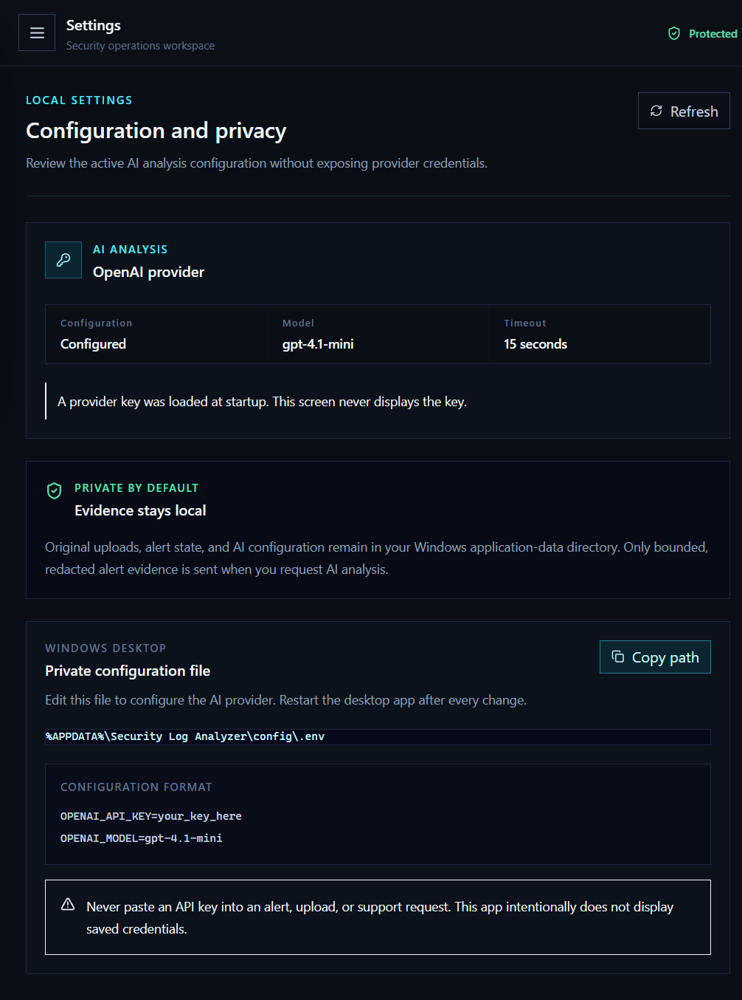
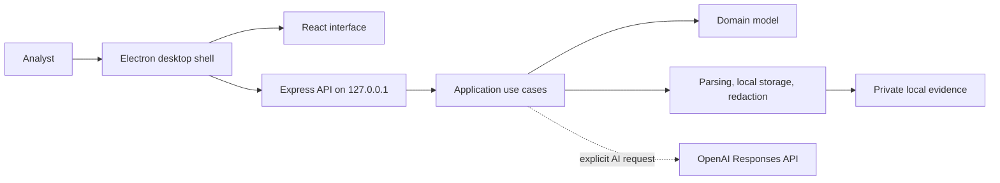

# Security Log Analyzer

Security Log Analyzer is a local-first Windows security log workstation. It imports Windows event
exports, normalizes the records, presents an analyst alert queue, preserves triage decisions, and
can request a bounded, redacted AI assessment for a selected alert.

The desktop application hosts its interface and API on a private loopback address. Original
evidence remains on the workstation; the AI provider receives only redacted, bounded event
evidence when an analyst explicitly requests an assessment.

## Screens

### Dashboard



The dashboard shows upload volume, normalized-event counts, skipped records, and recent parsed
exports.

### Alert Investigation



The alert queue supports host, severity, and status filters. Select an alert to inspect its
evidence, save triage state, and request an AI assessment.

### Settings



The Settings screen reports whether AI analysis is configured, the active model, timeout, and the
private Windows configuration location. Credentials are never displayed in the UI.

## Install On Windows

1. Download the latest `Security Log Analyzer Setup <version>.exe` from the
   [GitHub Releases page](https://github.com/eforendless/Security-log-analyzer/releases).
2. Run the installer and launch **Security Log Analyzer** from the Start menu or desktop shortcut.
3. Open **Uploads** and select a log export.
4. Review derived events in **Alerts** and save analyst triage decisions where appropriate.

The installer is per-user and does not expose the internal API to the local network.

## Import Logs

The application accepts these file types:

- Windows Event Log: `.evtx`
- Text exports: `.txt`, `.log`, `.csv`, `.json`, `.xml`

Text-line exports must contain one event per line using this shape:

```text
2026-07-30T15:45:02Z error Security-Auditing 4688 PowerShell execution policy bypass host=WORKSTATION-07 user=john.doe
```

Required values are timestamp, level, provider, and numeric event ID. Optional `host` and `user`
attributes let the interface filter and group evidence. CSV, JSON, XML, and EVTX imports use the
normalization aliases documented in the source code.

After an upload succeeds, confirm the parsed-event count and skipped-record count. A valid upload
with zero events usually means the file’s structure is not a supported event schema rather than a
security finding.

## Alert Workflow

1. Import a log from **Uploads**.
2. Open **Alerts** and select an event-derived alert.
3. Inspect the host, account, event ID, event message, timestamp, and source-record reference.
4. Set the analyst status to `Open` or `Triaged`, write a concise note, and choose **Save triage**.
5. Use the host, severity, and status filters to focus the queue.

Severity is deterministic and based on normalized event level:

| Event level   | Alert severity |
| ------------- | -------------- |
| `information` | Informational  |
| `warning`     | Medium         |
| `error`       | High           |
| `critical`    | Critical       |
| Other values  | Low            |

## Enable AI Analysis

AI analysis is optional and is initiated only from a selected alert’s **Analyze alert** button.

1. Open **Settings**.
2. Copy the private configuration path, then open that `.env` file in a text editor.
3. Add a provider key and optional model:

   ```dotenv
   OPENAI_API_KEY=your_key_here
   OPENAI_MODEL=gpt-4.1-mini
   ```

4. Fully close the desktop application and launch it again.
5. Return to an alert and choose **Analyze alert**.

The Settings screen must say `Configured` before the app can make an AI request. A provider error
with HTTP `429` means the key loaded successfully but the OpenAI project needs available API
quota, billing, rate-limit capacity, or model access.

Successful analysis includes a severity, confidence, concise summary, explanation, MITRE
techniques, recommendations, model name, and prompt version.

## Privacy And Security

- Original uploads, metadata, alerts, triage state, and analysis results are stored below:
  `%APPDATA%\Security Log Analyzer\uploads`.
- The desktop AI configuration is stored below:
  `%APPDATA%\Security Log Analyzer\config\.env`.
- API keys are server-side only and are never returned by an endpoint or displayed in the UI.
- The embedded API uses an ephemeral `127.0.0.1` port and cannot be reached from other devices.
- Electron uses context isolation, sandboxed rendering, and disabled renderer Node integration.
- Uploaded evidence is not served as public static content.
- Before an AI request, the app redacts configured sensitive patterns and bounds the evidence size.
- The API applies secure headers, request IDs, rate limits, multipart caps, and strict CORS rules.

Treat imported evidence and API credentials as sensitive. Do not add keys to source files,
screenshots, support tickets, or GitHub issues. Revoke a provider key immediately if it is exposed.

## Troubleshooting

| Symptom                                    | Action                                                                                                                        |
| ------------------------------------------ | ----------------------------------------------------------------------------------------------------------------------------- |
| Blank desktop window                       | Install the latest release. Version `1.0.1` fixes local asset loading in the desktop shell.                                   |
| `OPENAI_API_KEY is not configured`         | Verify the private `.env` path from **Settings**, ensure `OPENAI_API_KEY=` has a non-empty value, then fully restart the app. |
| AI request returns HTTP `429`              | The key reached OpenAI. Check project billing, usage limits, rate limits, and access to the selected model.                   |
| Upload succeeds but has zero parsed events | Use a supported structured export or the one-line text format described above.                                                |
| Unsupported file error                     | Import `.evtx`, `.txt`, `.log`, `.csv`, `.json`, or `.xml`.                                                                   |
| No alerts shown                            | Confirm that the upload parsed events successfully, then remove queue filters and refresh.                                    |

## Development

### Prerequisites

- Node.js 22 or later
- npm 10 or later
- Windows is required to produce the NSIS desktop installer

### Start Local Development

```powershell
npm install
npm run dev
```

The browser UI runs at `http://127.0.0.1:5173` and proxies API calls to the development API.

### Run The Desktop Shell

```powershell
npm run desktop:dev
```

### Quality Checks

```powershell
npm run format:check
npm run lint
npm run typecheck
npm run test
npm run build
npm audit --omit=dev --audit-level=high
```

### Package The Windows Installer

```powershell
npm run desktop:package
```

The installer is placed in `release/`. For public distribution, configure an application icon and
a Windows code-signing certificate in the packaging environment.

## Architecture



The monorepo keeps the dependencies pointed inward:

```text
apps/web          React analyst interface
apps/api          Express routes and HTTP composition
apps/desktop      Electron Windows host and installer configuration
packages/domain   Event, upload, alert, and port definitions
packages/application  Use cases and projections
packages/infrastructure  EVTX/text parsers, storage, redaction, OpenAI adapter
packages/contracts  Shared Zod API schemas and inferred types
infra              Docker, Compose, and Nginx deployment assets
docs               Operations documentation and screenshots
```

See [docs/OPERATIONS.md](docs/OPERATIONS.md) for local operations, Docker deployment, and incident
response guidance.

## Release And Support

- [Releases](https://github.com/eforendless/Security-log-analyzer/releases)
- [Issue tracker](https://github.com/eforendless/Security-log-analyzer/issues)

Report defects with the app version, Windows version, a sanitized export or reproduction steps,
and the exact visible error message. Never include API keys or raw sensitive log data.
